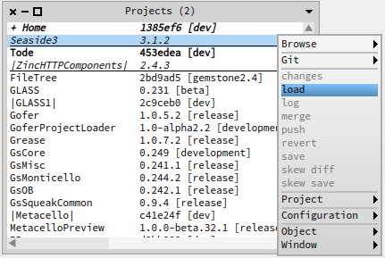

# Seaside31 [](https://travis-ci.org/GsDevKit/Seaside31)
The [GsDevKit Seaside31 project][3] is a fork of [Seaside][4]. 

## Register Project

```Shell
$GS_HOME/projects/zinc/createProjectEntry <stone-name> [ <group-name> .... ]
```

Use the `-h` option for information about specifying the \<group-name\> list.

###Batch Install/Update
From the shell:

```Shell
$GS_HOME/projects/seaside31/loadProject <stone-name>
```

###Interactive Install/Update
Within tODE:

   * from tODE command line:


      ```Shell
      project load Seaside31
      ```

   * from tODE project list:

     

[3]: https://github.com/GsDevKit/Seaside31
[4]: http://seaside.st/
