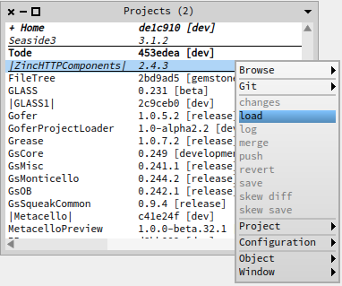

#GsDevKit Installation instructions for Zinc
The [GsDevKit Zinc project][3] is a fork of [Sven Van Caekenberghe's Zinc project][4]. 

Currently only the *Core* and *Tests* packages have been ported to GsDevKit:
* Zinc-HTTP
* Zinc-Tests
* Zinc-Character-Encoding-Core
* Zinc-Character-Encoding-Tests
* Zinc-FileSystem-Legacy
* Zinc-Resource-Meta-Core
* Zinc-Resource-Meta-Tests

## Zinc 2.4.3 for GemStone 2.4 and 3.x [](https://travis-ci.org/gs_master/zinc)
This is the version of Zinc that is currently recommended for use. 
This version of Zinc depends upon GLASS1 for proper operation.

To install from the shell:

```Shell
$GS_HOME/projects/zinc/loadProject <stone-name>
```

To install from tODE command line:

```Shell
project load ZincHttpComponents
```

To install from tODE project list:



[3]: https://github.com/GsDevKit/zinc
[4]: https://github.com/svenvc/zinc
